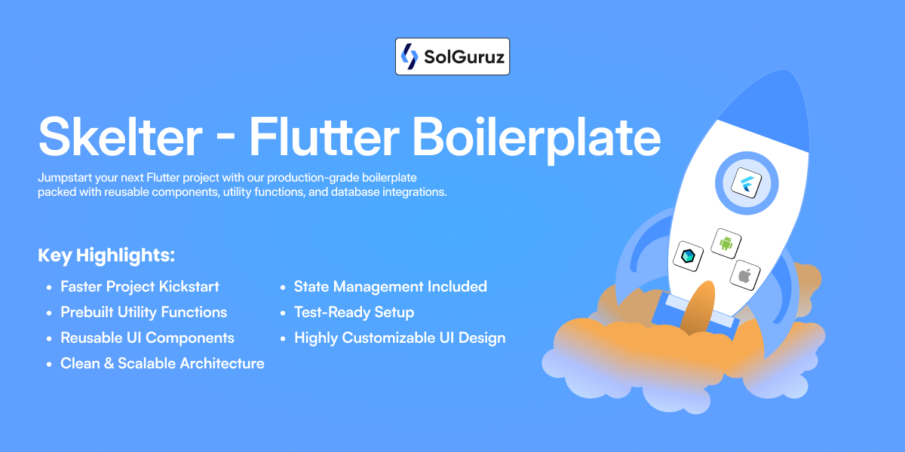

# Skelter Project


<br/>


<br/>


A comprehensive Flutter skelter project incorporating best practices, modern architecture, and
boiler plate code for rapid application development.

## 📚 Explore Our Documentation

- Accelerate your development with resources designed to help you build better and faster.  
- For **detailed guides, configuration setup, and best practices**, visit our documentation:

## 🔗 Get Started
👉 [**Explore the Skelter Docs**](https://docs.solz.me/docs/intro)

## Technology Stack

- **Flutter Version:** ^3.32.0
- **Dart SDK:** ^3.8.0
- **State Management:** BLoC
- **Navigation:** Auto Route
- **Backend Integration:** Firebase (Core, Analytics, Crashlytics, Auth)
- **Authentication:** Firebase Auth, Google Sign-In, Apple Sign-In
- **UI Components:** Custom widgets, Flutter SVG, Shimmer effects
- **Testing:** Flutter Test, Bloc Test, Alchemist (Golden Tests), Mocktail
- **Code Generation:** Build Runner, Auto Route Generator, Flutter Gen Runner

## Getting Started
**Skelter** is a production-ready **Flutter starter** designed to help teams ship high-quality apps faster. It’s open-source, scalable, and built with proven patterns so you can focus on delivering features—not boilerplate.

### Flavors

This project supports three flavors:

- **dev**
- **stage**
- **prod**

### Environment Variables

Create a `.env` file in the project root directory with the following values:

```
DEV_API_BASE_URL=https://dev.example.com/api
STAGE_API_BASE_URL=https://stage.example.com/api
PROD_API_BASE_URL=https://prod.example.com/api
```

Replace the URLs with your actual API endpoints.

### Building APK/IPA

To build for a specific flavor, use the following commands:

**Android APK (dev flavor):**

```
flutter build apk --flavor dev --dart-define=APP_FLAVOR=DEV
```

**iOS IPA (prod flavor):**

```
flutter build ipa --export-method=ad-hoc --flavor prod --dart-define=APP_FLAVOR=PROD 
```

### SSL Certificate Hash Setup

Follow these steps to configure SSL pinning in your Flutter project.

1. **Add Certificate Hash Variables to `.env`**  
   Add the SHA-256 SSL public key fingerprints for each flavor:

   ```
   CERT_HASH_DEV="add_your_dev_hash_here"
   CERT_HASH_STAGE="add_your_stage_hash_here"
   CERT_HASH_PROD="add_your_prod_hash_here"
   ```

2. **Get Your Certificate Hash**  
   Run the following command (replace `yourdomain.com` with your API domain):

   ```bash
   openssl s_client -connect yourdomain.com:443 -servername yourdomain.com </dev/null 2>/dev/null \
     | openssl x509 -pubkey -noout \
     | openssl pkey -pubin -outform DER \
     | openssl dgst -sha256 -binary \
     | openssl enc -base64
   ```

   **Example output:**
   ```
   406f8ac14c60a793be7aa284fc61a3cdcdbd79aa8c59cef535baffefd7278a5d
   ```
   Copy this value into the matching `CERT_HASH_*` variable in your `.env` file.

3. **Use the Certificate Hash in Code**  
   Add a method to fetch the correct hash for the current flavor:

   ```dart
   String _getCertHash() {
     final hash = switch (AppConfig.appFlavor) {
           AppFlavor.dev => dotenv.env['CERT_HASH_DEV'],
           AppFlavor.stage => dotenv.env['CERT_HASH_STAGE'],
           AppFlavor.prod => dotenv.env['CERT_HASH_PROD'],
         } ?? '';

     if (hash.isEmpty) {
       throw Exception(
         '[SSL Pinning] CertificateHash not found for: ${AppConfig.appFlavor.name}',
       );
     }

     debugPrint('[SSL Pinning] SHA-256 hash: "$hash"');
     return hash;
   }
   ```

4. **Reference**  
   For a detailed guide, see:  
   [Securing Your Flutter App by Adding SSL Pinning](https://dwirandyh.medium.com/securing-your-flutter-app-by-adding-ssl-pinning-474722e38518)
---

## Analytics

This project contains Microsoft Clarity, a free analytics tool that helps you understand user interactions within your app.
It offers session replays, heatmaps, and behavior insights.

### Key Features

* Session Replays
* Heatmaps
* Behavior Insights (rage/dead taps)
* Custom Tags & Events
* GDPR/CCPA compliant

### Privacy & Security

* Mask sensitive fields & manual consent control

### Important Links

* [Clarity Flutter SDK](https://pub.dev/packages/clarity_flutter)
* [Clarity Official Blog](https://clarity.microsoft.com/blog/clarity-sdk-for-flutter-mobile-apps/)

---

## Architecture and Coding Standards

This project follows a clean architecture approach with BLoC pattern for state management, ensuring:

### Code Organization

- **Separation of Concerns**: UI, business logic, and data access are kept separate
- **Modular Structure**: Features are organized into independent modules
- **Dependency Injection**: Services and repositories are properly injected
- **Testability**: All components are designed to be easily testable
- **Widget Best Practices**: Keep widgets small and create classes instead of helper methods
- **Bloc Usage**: Get values from bloc with context.select() instead of passing in widget parameters

### BLoC Architecture

The project uses the BLoC (Business Logic Component) pattern to separate business logic from UI:

- **Events**: Input events triggered by user interactions
- **States**: Output states representing UI changes
- **BLoCs**: Components that convert events to states

Code structure follows this pattern:

```
feature/
├── bloc/
│   ├── feature_bloc.dart
│   ├── feature_event.dart
│   ├── feature_state.dart
├── models/
├── repository/
└── screens/
```

### Coding Guidelines

- Use `final` and `const` where appropriate
- Follow the [Flutter style guide](https://dart.dev/guides/language/effective-dart/style)
- Keep methods small and focused
- Write meaningful comments for complex logic
- Use proper naming conventions (camelCase for variables/methods, PascalCase for classes)

## Localization

The project is set up with Flutter's internationalization system:

- Localization files are located in `lib/i18n/`
- Base ARB file is `app_en.arb`
- The output localization file is `app_localizations.dart`

To add a new language:

1. Create a new ARB file in the `lib/i18n/` directory (e.g., `app_es.arb`)
2. Run `flutter gen-l10n` to generate localization code
3. Access translations using `AppLocalizations.of(context).translationKey`

## Assets Management

Assets are organized as follows:

- **Icons**: Located in `assets/icons/` (SVG and PNG formats)
- **Images**: Located in `assets/images/`
- **Fonts**: Located in `assets/fonts/Inter/`

The project uses code generation for type-safe asset access. When adding new assets:

1. Add the asset to the appropriate directory
2. Run `flutter pub run build_runner build` to update generated asset references
3. Access assets using the generated constants

## Golden Testing

The project uses Alchemist for golden testing, a powerful tool for UI regression testing.

### What are Golden Tests?

Golden tests compare the rendered UI to a "golden" reference image. This helps detect unintended
visual changes during development.

### How to Use Golden Tests

1. **Creating a Golden Test**:
   ```dart
   goldenTest(
     'Widget renders correctly',
     builder: () => GoldenTestGroup(
       children: [
         GoldenTestScenario(
           name: 'default state',
           child: YourWidget(),
         ),
       ],
     ),
   );
   ```

2. **Running Tests**:
   ```bash
   flutter test --update-goldens test/golden_test.dart  # Update golden files
   flutter test test/golden_test.dart                   # Run tests against existing golden files
   ```

3. **Managing Golden Files**:
    - Golden files are stored in the `/golden/macos` and `/golden/linux`' directory
    - Use `copy_golden_images.sh` script to copy golden images to the linux directory for CI/CD
      environments

For more details, refer to the **Technical Document on Golden Test Cases** and **alchemist**
library.

## 🤝 Contributing

We welcome contributions! If you find a bug, want to add a feature, or improve the documentation, feel free to create an issue or submit a pull request.

Please follow our [CONTRIBUTING.md](./CONTRIBUTING.md)

## 💡 Why Open Source?

At SolGuruz, we believe in giving back to the developer community.
We’ve built apps for global clients using these internal practices and decided to share our foundation with YOU — the builders of tomorrow.

## ❤️ Credit & Attribution

If you use Skelter in your project, we’d love to hear about it!
Give us a ⭐ on GitHub and mention [SolGuruz](https://solguruz.com) in your credits or README.
It keeps us motivated to share more tools, kits, and open-source love.

## License

Copyright 2025 SolGuruz

Licensed under the Apache License, Version 2.0 (the "License");
you may not use this file except in compliance with the License.
You may obtain a copy of the License at

    http://www.apache.org/licenses/LICENSE-2.0

Unless required by applicable law or agreed to in writing, software
distributed under the License is distributed on an "AS IS" BASIS,
WITHOUT WARRANTIES OR CONDITIONS OF ANY KIND, either express or implied.
See the [License](./LICENSE) for the specific language governing permissions and
limitations under the License.